<div align="center">

# 🧠 GhaithAI | غيث

###  AI mental health & clinical telehealth platform

*Two modules, one goal: make mental health support accessible, stigma-free, and clinically safe across the MENA region.*


</div>

---

> ⚠️ **Medical disclaimer**
> GhaithAI is **not** a licensed medical practitioner. It does not diagnose, prescribe, or replace professional clinical judgment. Every AI output is a decision-support tool for qualified professionals, or first-step guidance that encourages individuals to seek professional care.

---

## 📖 Table of Contents

1. [Overview](#-overview)
2. [The Problem](#-the-problem)
3. [Modules & Features](#-modules--features)
4. [Doctor-Assist Session Workflow](#-doctor-assist-session-workflow)
5. [AI Report Pipeline](#-ai-report-pipeline)
6. [Architecture](#-architecture)
7. [Tech Stack](#-tech-stack)
8. [Project Structure](#-project-structure)
9. [Clinical Safety & Ethics](#-clinical-safety--ethics)
10. [Sprint History & Roadmap](#-sprint-history--roadmap)

---

## 🌍 Overview

**GhaithAI** (غيث, "rain that brings relief") is an AI-powered mental health platform built as a graduation project. It has two complementary modes:

| Mode | For | What it does |
|---|---|---|
| **Personal Support** | Individuals | A safe, private, AI-driven space for emotional support, mood tracking, journaling, and self-help, a first step that bridges the gap between *needing* help and *reaching* a professional |
| **Doctor-Assist** | Licensed clinicians | An intelligent clinical companion that records sessions, transcribes them, drafts structured clinical reports, and keeps the doctor in full control through a mandatory approval gate |

It is **Arabic-first** (RTL, Arabic transcription) with English support, designed for the MENA region.

## 🎯 The Problem

Mental health conditions are heavily under-treated because of **stigma, cost, and limited access to specialists**. Clinicians, meanwhile, lose hours to documentation. GhaithAI attacks both sides:

- 🩺 **Reduce clinician admin burden** by automating transcription and report drafting
- 🤝 **Provide a stigma-free, always-available first point of contact** for people in distress
- 🔒 **Keep humans in the loop**: AI drafts, doctors decide

---

## ✨ Modules & Features

### 🧑‍⚕️ Doctor-Assist Module
- Booking & clinic profile infrastructure for doctors and patients
- **Video/voice session room** using WebRTC (peer-to-peer audio) with SignalR signaling
- **Local session recording** of a mixed doctor + patient audio track
- **Post-session batch transcription** (AssemblyAI) with speaker labels and confidence scores
- **Transcript review & editing** per segment, with edit tracking
- **AI-generated clinical reports** (SOAP-style sections + risk summary + recommendations) via a LangFlow pipeline
- **Section-by-section editing** with a full audit history (what the AI wrote vs. what the doctor changed, auto-computed modification severity)
- **Mandatory doctor approval gate**: patients only ever see *approved* reports
- **AI feedback tagging** (Hallucination / MissingInfo / WrongTone / Other) and admin analytics to track model quality over time
- PDF export after approval

### 💬 Personal Support Module
- AI Emotional Listener (empathic, CBT / ACT / motivational-interviewing-informed)
- Mood tracking with emotion tags and streaks
- Structured journaling
- Home dashboard and self-help tools (breathing, micro-interventions)
- Risk-aware conversation design (crisis resources surfaced, no diagnostic labels, no medication advice)

---

## 🔄 Doctor-Assist Session Workflow

End-to-end flow from "Start Call" to approved report:

```mermaid
flowchart LR
    A[Start Session<br/>POST /sessions/start] --> B[WebRTC peer connection<br/>via SignalR signaling]
    B --> C[MediaRecorder records<br/>mixed doctor+patient audio]
    C --> D[End Session<br/>PUT /sessions/id/end]
    D --> E[Upload audio blob<br/>202 Accepted]
    E --> F[AssemblyAI batch<br/>transcription]
    F --> G[Frontend polls status<br/>exponential backoff]
    G --> H[Doctor reviews &<br/>edits transcript]
    H --> I[LangFlow<br/>3-agent report generation]
    I --> J[Doctor edits sections<br/>audit history recorded]
    J --> K{Doctor approves?}
    K -->|Yes| L[Report immutable<br/>visible to patient]
    K -->|No| J
```



**Frontend lifecycle state machine** (in `session-room.component.ts`):

```
Idle → Connecting → InCall → Ending → Uploading → Processing → Reviewable
```

**Key design choices**
- **Signaling ≠ media.** SignalR only exchanges the WebRTC offer / answer / ICE candidates; the audio flows directly peer-to-peer.
- **One side records.** The doctor's client mixes local + remote streams (Web Audio API `createMediaStreamDestination`) into a single track, so the recording is one clean file.
- **Batch, not streaming.** The audio is uploaded once after the session; the backend returns `202 Accepted` and the client polls status.
- **Audio is ephemeral.** Audio files are deleted on completion *or* failure.

---

## 🤖 AI Report Pipeline

The transcript, doctor's quick notes, and mood history are aggregated and sent to a **LangFlow** workflow running **DeepSeek-V4-Pro** through custom Fireworks AI components. It is a **three-agent sequential pipeline**:

```
Risk Analyser  →  Clinical Synthesiser  →  Pharmacology Guard
```

The result is stored as `AiDraftJson` (plus `AiModelVersion`) and split into `ReportSection`s: Subjective, Objective, Assessment, Plan, RiskSummary, Recommendations.

> **Honest characterisation:** the Doctor-Assist pipeline is a **deterministic, fixed state machine by design**, tied to safety requirement **CS-005** (no AI output reaches anyone without clinician review). It is *not* an autonomous agent. Genuine agency is reserved for the Personal Support **AI Emotional Listener**, where open-ended user input actually requires branching judgment.

---

## 🏗 Architecture

**Backend: Clean Architecture**

```
┌─────────────────────────────────────────────┐
│  API            Controllers · Background Jobs│
├─────────────────────────────────────────────┤
│  Application    DTOs · Service interfaces &  │
│                 implementations · Validators │
├─────────────────────────────────────────────┤
│  Infrastructure EF Core configs · Repository │
│                 implementations · UnitOfWork │
├─────────────────────────────────────────────┤
│  Domain         Entities · Enums · Repository│
│                 interfaces                   │
└─────────────────────────────────────────────┘
```

Patterns: **Generic Repository + Unit of Work**, **FluentValidation**, **ASP.NET Identity**, DTO-based contracts, background jobs (`TranscriptionPollingJob`) for STT status polling / webhook callbacks.

**Frontend: Angular 17** with standalone components, `OnPush` change detection, and RxJS, organised as feature modules (see below).

**Sprint 3 domain model** (colour-coded in the ERD):

| Area | Entities |
|---|---|
| Encounter | `ClinicalSession` |
| Documentation | `SessionNote`, `SessionTranscript` |
| Reporting | `ClinicalReport`, `ReportSection` |
| AI Audit | `ClinicalReportHistory` (1:1 with report) |
| AI Metadata | `ReportFeedbackTag` |

---

## 🧰 Tech Stack

| Layer | Technology |
|---|---|
| **Backend** | ASP.NET Core 8, C#, EF Core, SQL Server / LocalDB, ASP.NET Identity, FluentValidation |
| **Frontend** | Angular 17 (standalone, OnPush, RxJS), `@microsoft/signalr` |
| **Real-time** | SignalR (signaling), WebRTC (`RTCPeerConnection`), `MediaRecorder`, Web Audio API |
| **AI / ML** | LangFlow, Fireworks AI custom components, DeepSeek-V4-Pro |
| **Speech-to-Text** | AssemblyAI (post-session batch) |
| **Dev tooling** | Visual Studio, VS Code, SSMS, Swagger UI, ngrok, Angular DevTools |
| **Docs & design** | Mermaid.js ERDs, dbdiagram.io |

---

## 📁 Project Structure

### Backend (Sprint 3)

```
Domain/
├─ Entities/        ClinicalSession, SessionNote, SessionTranscript,
│                   ClinicalReport, ReportSection,
│                   ClinicalReportHistory, ReportFeedbackTag
├─ Enums/           SessionStatus, SessionType, SpeakerRole, NoteType,
│                   ReportStatus, SectionType, ModificationSeverity,
│                   FeedbackTagType
└─ Repositories/    I…Repository interfaces (one per entity)

Application/
├─ DTOs/            StartSession, TranscriptSegment, GenerateReportRequest,
│                   ReportSection, ApproveReport, CreateFeedbackTag, …
└─ Services/        ClinicalSessionService, SessionNoteService,
                    TranscriptionService, TranscriptAggregationService,
                    LangFlowClient, ReportGenerationService,
                    ReportApprovalService, ReportHistoryService,
                    ReportFeedbackService

Infrastructure/
├─ Configurations/  EF Core entity configurations
└─ Repositories/    Repository implementations + UnitOfWork

API/
├─ Controllers/     ClinicalSessions, SessionNotes, SessionTranscripts,
│                   ClinicalReports, ReportFeedback
└─ BackgroundJobs/  TranscriptionPollingJob
```

### Frontend

```
src/app/features/clinical-session/
├─ pages/
│  ├─ session-room.component.ts         # orchestrates the whole flow
│  ├─ transcript-review.component.ts    # review & edit segments
│  └─ report-editor.component.ts        # review & approve report
├─ components/
│  ├─ video-call-panel · call-controls · transcription-status
│  ├─ transcript-segment · report-section-card
│  └─ feedback-tag-dialog
├─ services/
│  ├─ session.service.ts            # start / end session (HTTP)
│  ├─ session-signalr.service.ts    # SignalR hub: offer/answer/ICE
│  ├─ webrtc.service.ts             # RTCPeerConnection + audio mixing
│  ├─ audio-recorder.service.ts     # MediaRecorder wrapper
│  ├─ transcript.service.ts         # upload / poll status / segments
│  └─ report.service.ts             # generate / edit / approve
├─ models/
└─ clinical-session.routes.ts
```

## 🛡 Clinical Safety & Ethics

Safety is a design constraint, not a feature.

- **Human-in-the-loop:** AI-generated reports are never shared with patients or third parties before explicit doctor approval (CS-005).
- **Immutable after approval** with a complete audit trail of every edit.
- **No diagnostic labels, no medication recommendations** in the Personal Support AI.
- **No roleplay** as a licensed physician or therapist.
- **Crisis escalation** independent of the AI engine; emergency resources surfaced on high-risk language.
- **Risk signals are aids, not diagnoses:** presented with supporting excerpts for clinician judgment.
- **Encouraging professional help-seeking**, avoiding dependency-inducing patterns and engagement-bait.
- **Privacy by design:** consent-first, minimum-necessary data, ephemeral audio, region-aware data handling (aligned with Egypt PDPL, GDPR, HIPAA principles).
- **Pharmacology Guard** stage in the report pipeline to catch unsafe medication content before a doctor sees the draft.

---

## 🗺 Sprint History & Roadmap

| Sprint | Focus | Status |
|---|---|---|
| 1 | Personal Support: mood tracking, journaling, home dashboard | ✅ Done |
| 2 | Booking / scheduling and doctor clinic profiles | ✅ Done |
| 3 | Doctor-Assist: WebRTC sessions, transcription, AI reports, approval, audit history, feedback analytics | ✅ Done |


<div align="center">

**Made with care for a region that deserves better mental health access. 💙**

</div>
